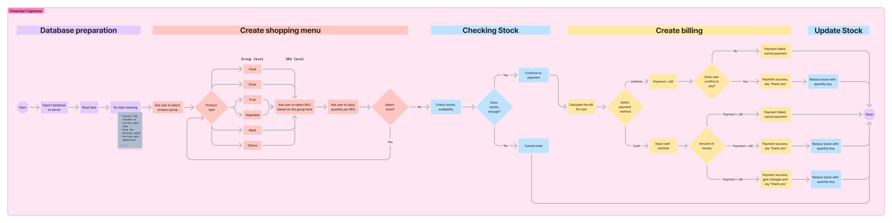
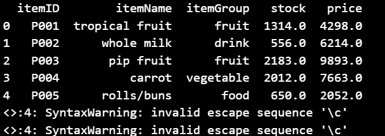
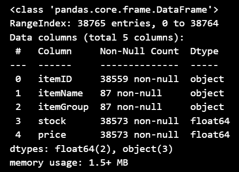
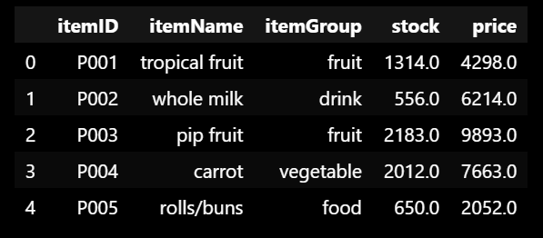
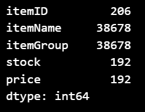
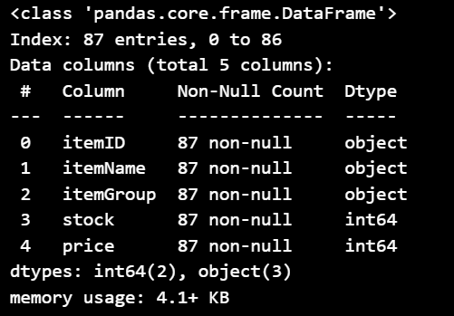
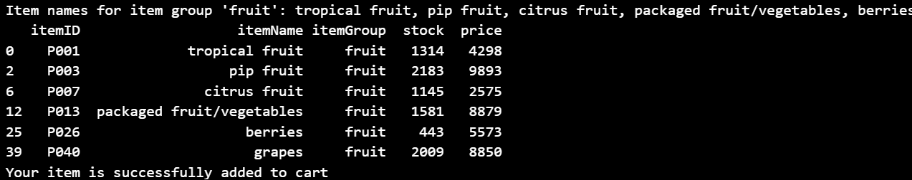
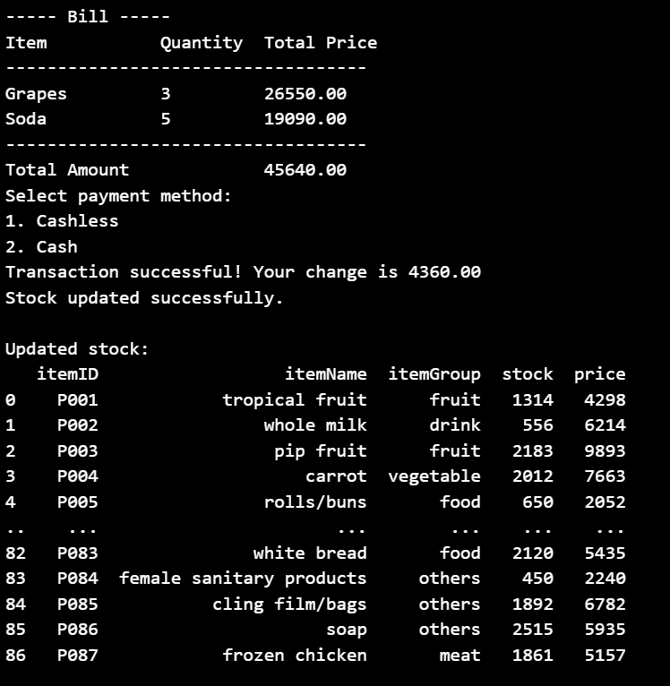

# Intro

Hi there! Welcome to my GitHub page. I’m excited to share my first project from Purwadhika, which I’ve named the **Capstone Project**. This project showcases a fundamental CRUD application, which stands for Create, Read, Update, and Delete.

In this project, I’ve implemented the following features:

- **Create**: Adding new records to the database.
- **Read**: Retrieving and displaying data from the database.
- **Update**: Modifying existing records.
- **Delete**: Removing records from the database.

I would love to engage in discussions with you all. Your feedback is invaluable to me, so please feel free to leave your comments and suggestions. This will help me improve and refine the project further.

I hope you find this project useful and informative.

Enjoy exploring! 😊

# Supermarket List for Retail Shoppers

# Description

This project aims to develop a comprehensive retail shopping application designed to enhance the shopping experience for users. The application will offer the following features:

1. **Product Catalog**:
    - **View Products**: Shoppers can browse through a list of available products, complete with details such as name, description, price, and stock availability.
    - **Search Functionality**: Users can search for specific products using keywords, making it easier to find items quickly.
2. **Order Management**:
    - **Add to Cart**: Shoppers can select items and add them to their virtual shopping cart.
    - **Quantity Selection**: Users can specify the quantity of each item they wish to purchase.
    - **Order Summary**: Before finalizing the purchase, shoppers can review their order, including item details, quantities, and total price.
3. **Billing and Payment**:
    - **Generate Bill**: Upon order submission, the system will generate a detailed bill for the shopper, listing all purchased items, their quantities, individual prices, and the total amount due.
    - **Payment Methods**: Shoppers can choose their preferred payment method, such as cash or cashless options (e.g., credit/debit cards, mobile payments).
4. **Inventory Management**:
    - **Update Inventory**: After an order is completed, the application will automatically update the product inventory to reflect the new stock levels, ensuring accurate and up-to-date information.

# Flowchart

You can see the flow of this project from this flowchart:


# Code Explanation

## Set up Project

First thing first, if your local Python does not have Pandas, install the Pandas Library by using

```jsx
pip install pandas
```

## Database Preparation

We will use this csv file as our database:

[groceries_stock.csv](https://prod-files-secure.s3.us-west-2.amazonaws.com/ea096081-7ff6-43d5-98cf-0d94e0a01e50/fe202dd4-3f60-4265-b173-938b72e654d4/groceries_stock.csv)

Import the csv by

```jsx
import pandas as pd

#upload CSV file
file_path = 'C:\capstoneproject\groceries_stock.csv'

# Read the CSV file
df = pd.read_csv(file_path)

# Display the first few rows of the DataFrame
print(df.head())
```

Code output:



Check the data type and do the data cleaning

```jsx
# To check the data types
df.info()

# Make the data into column
df.columns = ['itemID', 'itemName', 'itemGroup','stock', 'price']
df.head()
```

Code output:





Check the missing value

```jsx
# Checking for the missing values
nan_values = df.isna().sum()
nan_values
```

The output



The output shows there are 206 rows of missing data at itemID, 38678 rows of missing data for itemGroup and ItemName. And 192 rows of missing data for stock and price.

Data cleaning and changing data type

Previously we have checked there are missing values and the data type for stock and price are not correct. We will fix it using this code

```jsx
# there are missing values
df = df.dropna(subset=['itemID','itemName', 'stock', 'price'])

df['stock'] = df['stock'].astype('int')
df['price'] = df['price'].astype('int')
df.info()  # They are in correct datatype now
```

The output



Now we will make the the application shopping menu

```jsx
#Create the filter for user to select the item group 
def select_item_counts(df):
    item_group = input("Enter the item group: ").lower() 
    df['itemGroup'] = df['itemGroup'].str.lower()
    sku_counts = df[df['itemGroup'] == item_group].groupby('itemGroup').size().reset_index(name='count')
    
    if not sku_counts.empty:
        item_names = df[df['itemGroup'] == item_group]['itemName'].unique()
        print(f"Item names for item group '{item_group}': {', '.join(item_names)}")
    else:
        print(f"No SKUs found for item group '{item_group}'")
        return pd.DataFrame()  # Return an empty DataFrame if no SKUs are found
    
    return df[df['itemGroup'] == item_group]

#User need to select the itemName based on the selected itemGroup
def process_item_selection(df, cart):
    selected_group = select_item_counts(df)

    if not selected_group.empty:
        # Sorting the filtered DataFrame by itemGroup in descending order
        selected_group_sorted = selected_group.sort_values(by='itemGroup', ascending=False)
        print(selected_group_sorted)
        
        # Allow the user to select an item name
        item_name = input("Enter the item name: ").lower()
        selected_item = selected_group_sorted[selected_group_sorted['itemName'].str.lower() == item_name]
        
        if not selected_item.empty:
            stock = selected_item['stock'].sum()  # Assuming 'stock' is the column name for stock quantities
            price = float(selected_item['price'].values[0])  # Assuming 'price' is the column name for item prices
            # Allow the user to input a quantity
            user_quantity = int(input("Enter the quantity: "))

            if user_quantity <= stock:
                print("Your item is successfully added to cart")
                cart.append({'itemName': item_name, 'quantity': user_quantity, 'totalPrice': user_quantity * price})
            else:
                print("We are out of stock. Cannot proceed.")
        else:
            print(f"No data found for item name '{item_name}'")
    else:
        print("No data available for the selected item group.")

#Create option for user to add more product or not
def main(df):
    cart = []
    while True:
        process_item_selection(df, cart)
        
        # Ask for user to add more product
        add_more = input("Do you want to add more products? (yes/no): ").lower()
        if add_more != 'yes': #If NOT, continue to next logic
            print("Okay, stopping.")
            break
    
    #If user doesn't want to add more products then create bill
    if cart:
        print("\n----- Bill -----")
        print(f"{'Item':<15}{'Quantity':<10}{'Total Price':<10}")
        print("-" * 35)
        for item in cart:
            print(f"{item['itemName'].capitalize():<15}{item['quantity']:<10}{float(item['totalPrice']):<10.2f}")
        total_amount = sum(float(item['totalPrice']) for item in cart)
        print("-" * 35)
        print(f"{'Total Amount':<25}{total_amount:.2f}")

        # Call process_payment with total_amount
        if process_payment(total_amount):
            update_stock(df, cart)
            print("\nUpdated stock:")
            print(df)  # Print the DataFrame to see the updated stock

# Select payment method
def process_payment(total_amount):
    print("Select payment method:")
    print("1. Cashless")
    print("2. Cash")
    payment_method = input("Enter the number of your payment method: ")

    if payment_method == "1":
        confirmation = input("Are you sure to proceed the payment? (Yes/Cancelled): ")
        if confirmation.lower() == "yes":
            print("Transaction successful!")
            return True
        elif confirmation.lower() == "cancelled":
            print("Transaction cancelled.")
            return False
        else:
            print("Invalid input. Transaction cancelled.")
            return False
    
    elif payment_method == "2":
        cash = float(input("Enter the amount of cash: "))
        if cash < total_amount:
            print("Transaction failed. Insufficient cash.")
            return False
        elif cash == total_amount:
            print("Transaction successful!")
            return True
        else:
            change = cash - total_amount
            print(f"Transaction successful! Your change is {change:.2f}")
            return True
    
    else:
        print("Invalid payment method selected.")
        return False

def update_stock(df, cart):
    for item in cart:
        item_name = item['itemName']
        quantity_purchased = item['quantity']
        df.loc[df['itemName'] == item_name, 'stock'] -= quantity_purchased
    print("Stock updated successfully.")

main(df)
```

The output


